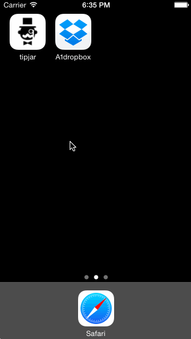

# A1dropbox

Dropbox prototype for CodePath

Time Required: 1,000 Hours

Stories: 
User can tap through the 3 welcome screens. 
User can follow the create user flow.
    On the create user form, the user can tap the back button to go to the page where they can sign in or create an account.
    After creating the account, user can view the placeholders for Files, Photos, and Favorites as well as the Settings screen.
    User can log out from the Settings screen.
User can follow the sign in flow.
    User can log out from the Settings screen.
Added transition (non)animations to segues

App Demo:

